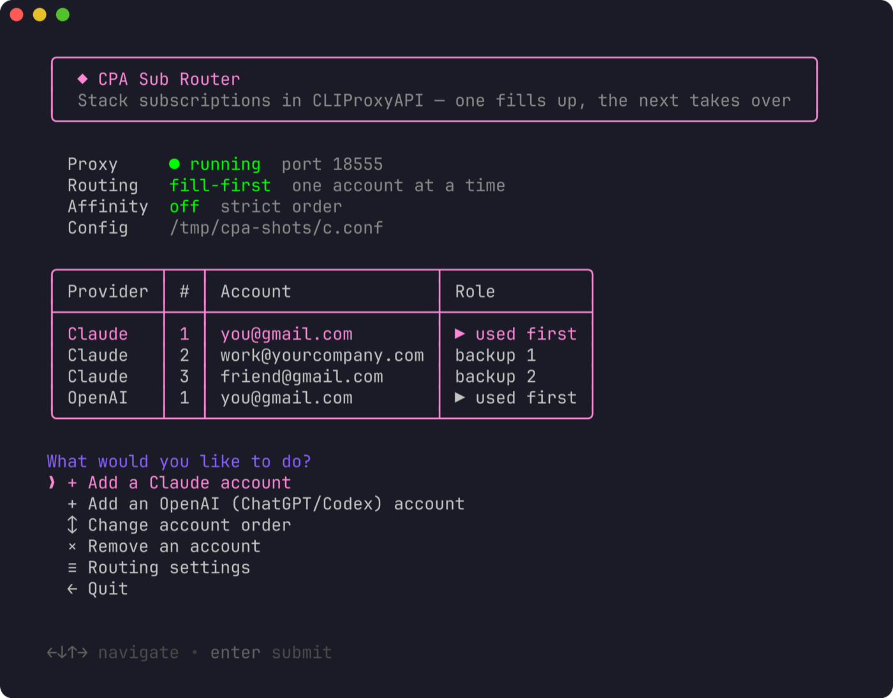
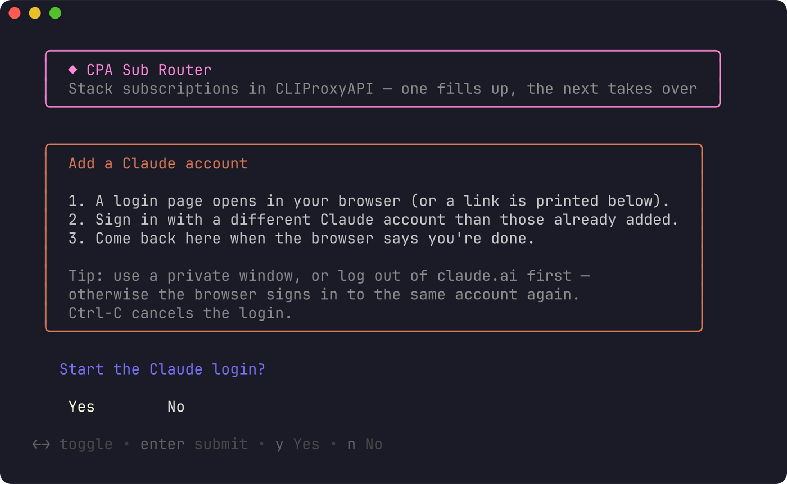
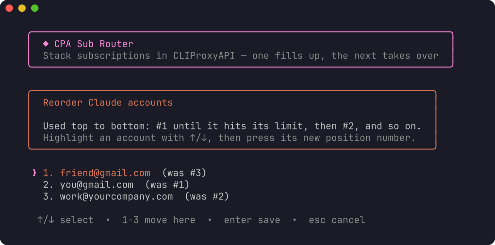
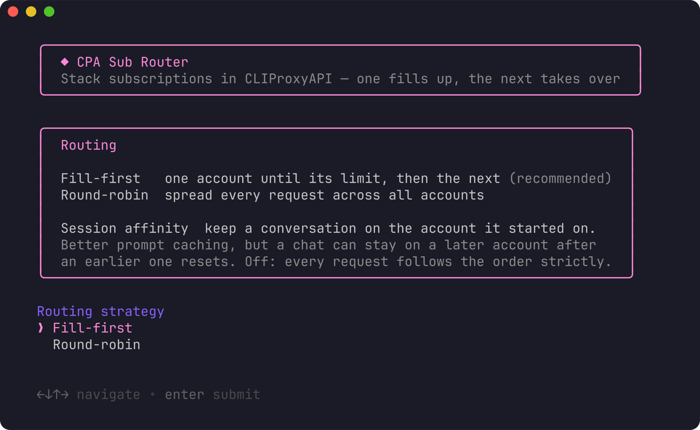
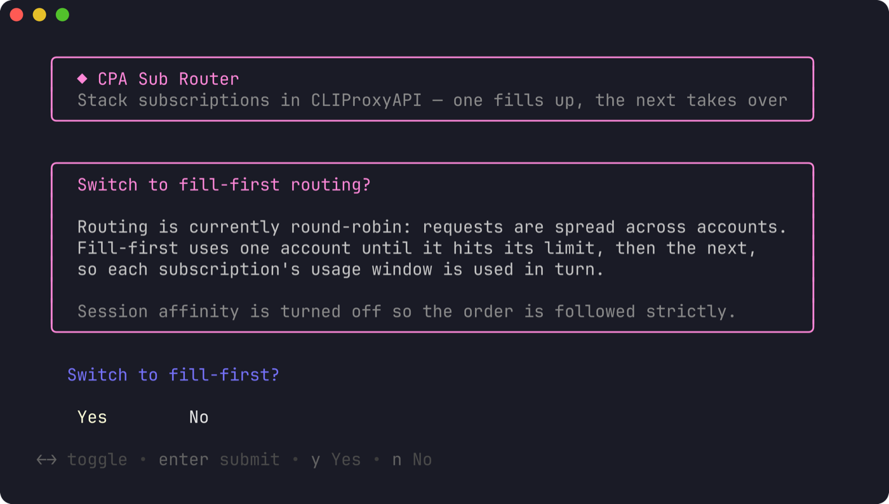

# CPA Sub Router

Stack multiple Claude and OpenAI (ChatGPT/Codex) subscriptions behind
[CLIProxyAPI](https://github.com/router-for-me/CLIProxyAPI) with **fill-first** routing:
the first account is used until it hits its usage limit, then the next one takes over.

One command, nothing to install:

```bash
bash <(curl -fsSL https://raw.githubusercontent.com/azain47/cpa-subrouter/main/setup.sh)
```

`curl -fsSL https://raw.githubusercontent.com/azain47/cpa-subrouter/main/setup.sh | bash` works too.



## Features

**Add accounts.** Runs CLIProxyAPI's own OAuth login for Claude or OpenAI and
notices when the browser signed in to an account you already added. Ctrl-C
cancels a login without leaving the tool.



**Reorder.** Highlight an account with ↑/↓ and press a number to move it to that
position — the others shift around it. Enter saves, Esc cancels. Number keys
reach positions 1–9.



**Routing settings.** Fill-first or round-robin, and session affinity on/off.
The current settings are pre-selected; Esc cancels without changing anything.



**Remove accounts.** The credential file is moved to `~/.cli-proxy-api-removed`,
not deleted — move it back to restore the account. An earlier removed copy with
the same name is never overwritten.

On first run, if routing isn't fill-first yet, it offers to switch:



## How it works

- **Claude and OpenAI are separate pools.** CLIProxyAPI routes by model name
  (`claude-*` → Claude accounts, `gpt-*`/Codex → OpenAI accounts); fill-first
  applies within each pool.
- **Fill-first** is CLIProxyAPI's `routing.strategy: fill-first`. It always picks the
  highest-`priority` available account, so CPA Sub Router writes an explicit
  top-level `priority` into each account's auth file to pin the order (without it,
  order falls back to file names, which contain random hashes).
- **Round-robin** only rotates among accounts that share the highest priority, so
  switching to round-robin gives every account the same priority; switching back
  restores a fill-first order.
- **Session affinity** off means requests strictly follow the order. On keeps a
  conversation on one account for better prompt caching, at the cost of strict
  ordering.
- CLIProxyAPI hot-reloads its config and auth files — no restart needed.

## What it touches

| Path | Change |
| --- | --- |
| CLIProxyAPI config | `routing.strategy` / `routing.session-affinity` only, keeping indentation, comments and line endings; a timestamped `.bak` copy is made first and the result is re-read before it's saved |
| Auth dir (`auth-dir`, default `~/.cli-proxy-api`) | new logins, plus a top-level `"priority"` field per account — written to a temp file in the same folder, then renamed, so CLIProxyAPI never sees a half-written file |
| `~/.cli-proxy-api-removed` | accounts you remove |

The UI runs in the terminal's alternate screen, so your scrollback is untouched;
a summary of the final order is printed when you quit. It fits 80-column terminals.

Boxes, tables and prompts use [gum](https://github.com/charmbracelet/gum). If gum v2
isn't installed, a pinned release (v2.0.2) is downloaded to a temp directory,
checked against a SHA-256 embedded in the script, and deleted when the script exits.

## Requirements

- macOS or Linux (arm64 / x86_64), `bash` 3.2+, `curl`
- CLIProxyAPI — on macOS the script offers `brew install cliproxyapi` if it's missing
- A block-style `routing:` section (the default). Configs with `routing: {…}` on one
  line, or with indented top-level keys, are detected and left untouched.

## Options

```bash
bash <(curl -fsSL .../setup.sh) --config /path/to/config.yaml --bin /path/to/cliproxyapi
```

`CLIPROXYAPI_CONFIG` and `CLIPROXYAPI_BIN` environment variables work as well.
Without them, the script uses the config of a running CLIProxyAPI, then looks in
the Homebrew locations (`/opt/homebrew/etc/cliproxyapi.conf`,
`/usr/local/etc/cliproxyapi.conf`), `~/cliproxyapi/config.yaml`, and
`~/.cli-proxy-api/config.yaml`.

## Tips

- When adding a second account for the same provider, sign in from a private
  window (or log out first) — otherwise the browser reuses the account you
  already added. If that happens, nothing breaks: CLIProxyAPI names each
  credential file after the account, so the existing file is just refreshed,
  no duplicate is created, and CPA Sub Router tells you which account it was.
- Subscriptions are for their owners. Check Anthropic's and OpenAI's terms before
  sharing an account with anyone else.
